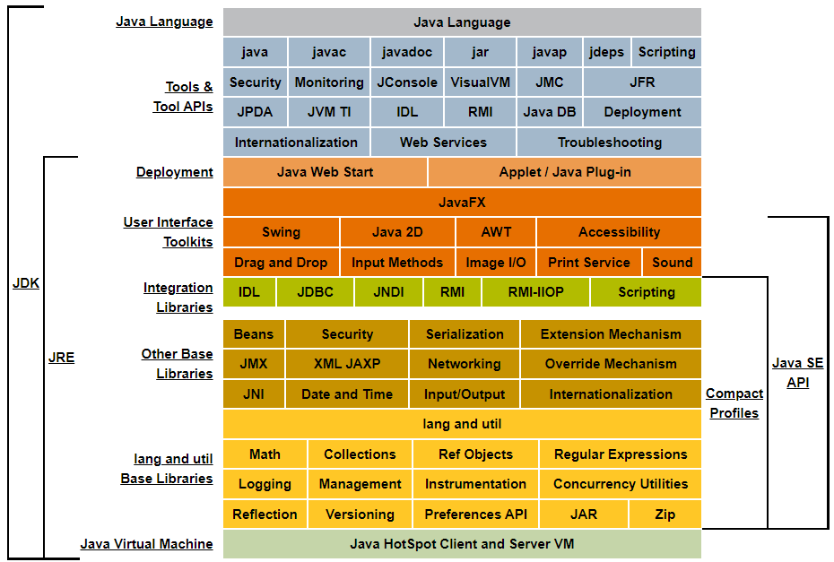
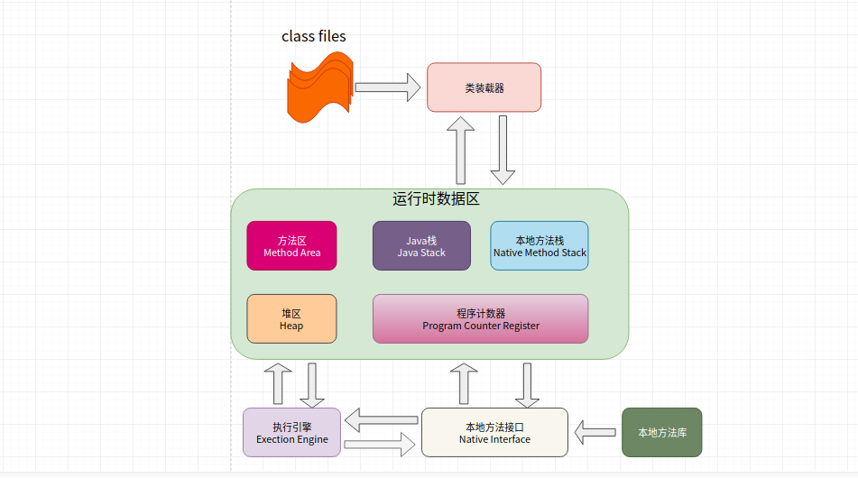
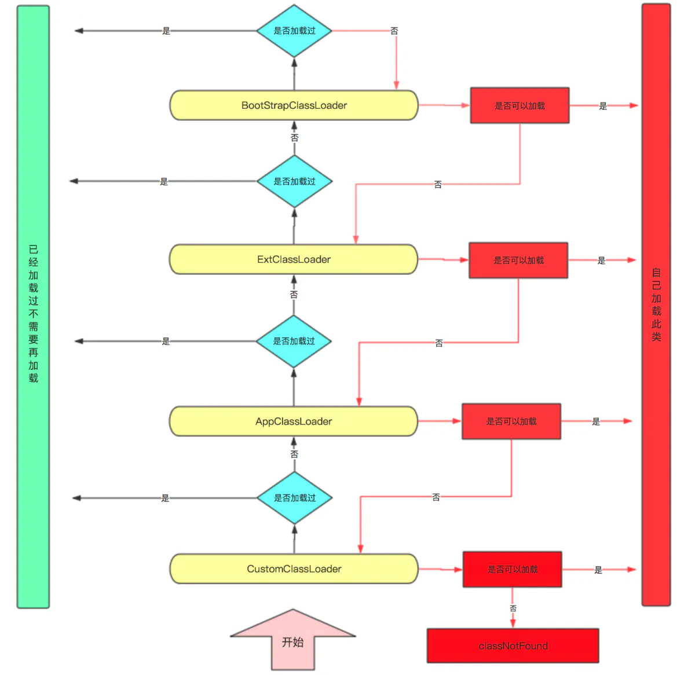

# Java

JDK 8 是 JRE 8 的超集，包含 JRE 8 中的所有内容，以及开发小程序和应用程序所需的编译器和调试器等工具。

JRE 8 提供了库、Java 虚拟机 (JVM) 和其他组件来运行用 Java 编程语言编写的小程序和应用程序。

请注意，JRE 包括 Java SE 规范不需要的组件，包括标准和非标准 Java 组件。

Version: JDK8

[API文档](https://docs.oracle.com/javase/8/docs/api/index.html)

[官网教程](https://docs.oracle.com/javase/tutorial/index.html)

[JDK下载地址](https://www.oracle.com/cn/java/technologies/javase-downloads.html)

[JDK8下载地址](https://www.oracle.com/java/technologies/javase/javase-jdk8-downloads.html)

## IDE

### Eclipse

[下载](https://www.eclipse.org/downloads/packages/)

### IDEA

[下载](https://www.jetbrains.com/idea/download/)

重置插件

插件仓库地址:[https://plugins.zhile.io](https://plugins.zhile.io)

插件: IDE Eval Reset

## JVM

Java Virtual Machine(java虚拟机，HotSpot VM)

### 特点

1. 一次编译，导出运行
2. 自动内存管理
3. 自动垃圾回收功能

### 生命周期

1. 启动
    * 当启动一个Java程序时，一个JVM实例就产生了。
    * 任何一个拥有public static void main(String[] args)函数的class都可以作为JVM实例运行的起点
2. 执行
    * JVM内部有两种线程：守护线程和非守护线程。
    * main()属于非守护线程，守护线程通常由JVM自己使用，java程序也可以标明自己创建的线程是守护线程。
3. 结束
    * 当程序中的所有非守护线程都终止时，JVM才退出。
    * 若安全管理器允许，程序也可以使用java.lang.Runtime类或者java.lang.System.exit()来退出。

### 流程

1. java源代码
2. 编译成class字节码文件
3. Class loader类加载(双亲委派机制)
4. 运行时数据区
    * 方法区(多线程共享)
    * 堆(多线程共享)
    * Java栈
    * 本地方法栈
    * 程序计数器
5. Execution Engine执行引擎
6. 本地方法接口
7. 本地方法库

类加载器

1. Bootstrap classLoader(启动类加载器)
2. ExtClassLoader(标准扩展类加载器)
3. AppClassLoader(系统类加载器)
4. CustomClassLoader(用户自定义类加载器)

双亲委派机制

双亲委派机制的作用

1. 防止重复加载同一个class。通过委托去向上面问一问，加载过了，就不用再加载一遍。保证数据安全。
2. 保证核心class不能被篡改。通过委托方式，不会去篡改核心class，即使篡改也不会去加载，即使加载也不会是同一个.class对象了。不同的加载器加载同一个.class也不是同一个Class对象。这样保证了Class执行安全。

沙箱机制: 防止恶意代码污染java源代码

### 执行引擎

1. 解释器
2. JIT即时编译器
3. GC垃圾回收器(新生代、老年代、元数据)
    * Minor GC
    * Major GC
    * Full GC

## JMM

Java memory model(Java内存模型)

Java的并发采用的是共享内存模型

内存可见性:
> 在Java中，不同线程拥有各自的私有工作内存，当线程需要读取或修改某个变量时，不能直接去操作主内存中的变量，而是需要将这个变量读取到线程的工作内存的变量副本中，当该线程修改其变量副本的值后，其它线程并不能立刻读取到新值，需要将修改后的值刷新到主内存中，其它线程才能从主内存读取到修改后的值。

指令重排序
> 在执行程序时为了提高性能，编译器和处理器常常会对指令做重排序，指令重排序使得代码在多线程执行时会出现一些问题。

volatile
> 规定线程每次修改变量副本后立刻同步到主内存中，用于保证其它线程可以看到自己对变量的修改 规定线程每次使用变量前，先从主内存中刷新最新的值到工作内存，用于保证能看见其它线程对变量修改的最新值 为了实现可见性内存语义，编译器在生成字节码时，会在指令序列中插入内存屏障来防止指令重排序。

注意

1. 只能保证基本类型变量的内存可见性，对于引用类型，无法保证引用所指向的实际对象内部数据的内存可见性。
2. 只能保证共享对象的可见性，不能保证原子性。

## [JavaSE](./se)

## [JavaEE](./ee)

* [Xml](./ee/xml)
* [Servlet](./ee/servlet)
* [Mail](./ee/mail)
* [Jdbc](./ee/jdbc)
    * [Mysql](./ee/jdbc/mysql)
    * [Mybatis](./ee/jdbc/mybatis)
    * [hibernate](./ee/jdbc/hibernate)
    * [mongodb](./ee/jdbc/mongodb)
    * [redis](./ee/jdbc/redis)
* [Shiro](./ee/shiro)
* [WebSocket](./ee/websocket)
* [Amqp](./ee/amqp)
* [Swagger](./ee/swagger)
* [Web](./ee/web)
* [WebService](./ee/webservice)

## [阿里巴巴Java开发手册](./docs/pdf/阿里巴巴Java开发手册1.4.0.pdf)

## [日志](./log)

* [Jul](./log/jul)
* [Commons Logging](./log/commons-logging)
* [Slf4j](./log/logback)
* [logback](./log/logback)
* [log4j](./log/log4j)
* [log4j2](./log/log4j2)

## [单元测试](./test)

* [junit](./test/junit)
* [mock](./test/mock)

---

# Spring Framework

## [Spring](https://github.com/codingob/spring)

## [Spring-Boot](https://github.com/codingob/spring-boot)

## [Spring-Cloud](https://github.com/codingob/spring-cloud)

## [Spring-Cloud-Alibaba](https://github.com/codingob/spring-cloud-alibaba)

---

# 数据结构和算法

## [设计模式](./design)

## [算法](https://github.com/codingob/algorithm)

---

# 依赖模块管理

## Maven

[官网](https://maven.apache.org)

[下载](https://maven.apache.org/download.cgi)

[仓库](https://mvnrepository.com)

## Gradle

[官网](https://gradle.org/)

[下载](https://gradle.org/releases/)
