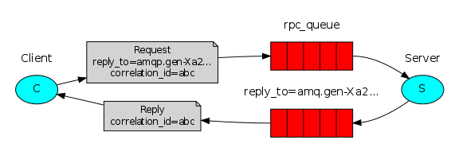

# RabbitMQ

[官网](https://www.rabbitmq.com/)

[文档](https://www.rabbitmq.com/api-guide.html)

依赖

```xml

<dependency>
    <groupId>com.rabbitmq</groupId>
    <artifactId>amqp-client</artifactId>
    <version>5.13.0</version>
</dependency>

```

## 简单队列


点对点模式,一个生产者,一个消费者

[示例](./src/main/java/com/demo/rabbitmq/queue)

## 工作队列


一个生产者对应多个消费者,竞争消费(一条消息只能有一个消费者获得消息)。

策略:

1. 轮询: 每个消费平均分配
2. 公平: 根据消费者处理消息的能力分配

公平模式

[示例](./src/main/java/com/demo/rabbitmq/work/fair)

轮询模式

[示例](./src/main/java/com/demo/rabbitmq/work/loop)

## 发布/订阅模式


多个消费者同时接收所有的消息，一个消息可以被多个消费者获得

[示例](./src/main/java/com/demo/rabbitmq/publish)

## 路由模式


生产者按routing key发送消息，不同的消费者端按不同的routing key接收消息。

[示例](./src/main/java/com/demo/rabbitmq/route)

## 主题模式


生产者按的routing key发送消息，消费者按字符串“匹配”接收消息。

* *: 匹配一个单词,
* \#: 匹配0个或多个单词

[示例](./src/main/java/com/demo/rabbitmq/topic)

## RPC模式

