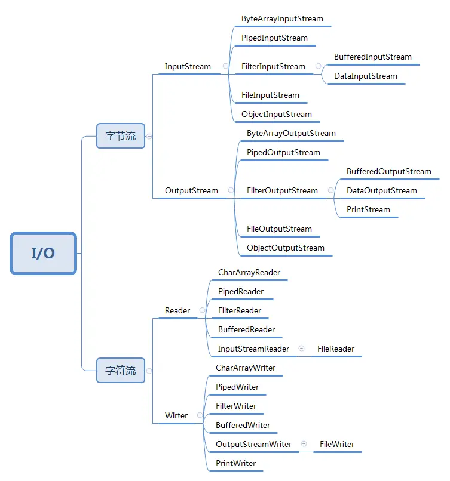
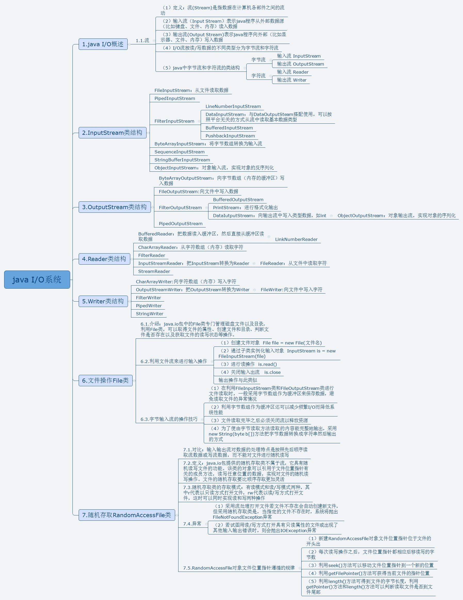

# IO流

## File

### FileInputStream

### FileOutputStream

### FileReader

### FileWriter

## 字节流

### InputStream

#### BufferedInputStream

#### DataInputStream

### OutputStream

#### BufferedOutputStream

#### DataOutputStream

## 字符流

### Reader

#### BufferedReader

### Writer

#### BufferedWriter